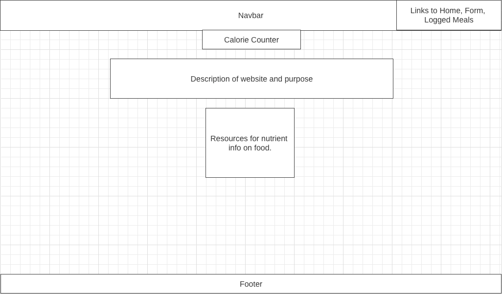
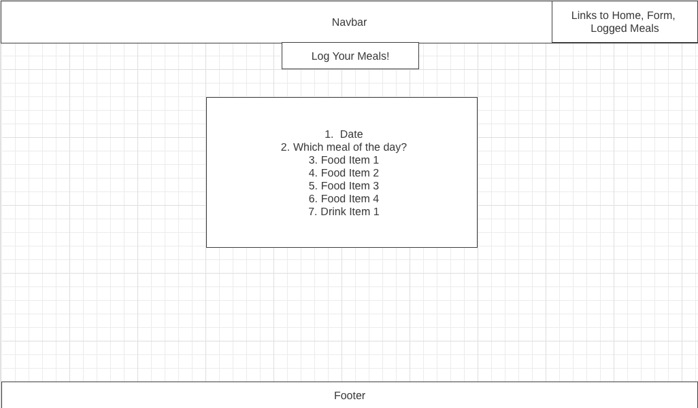
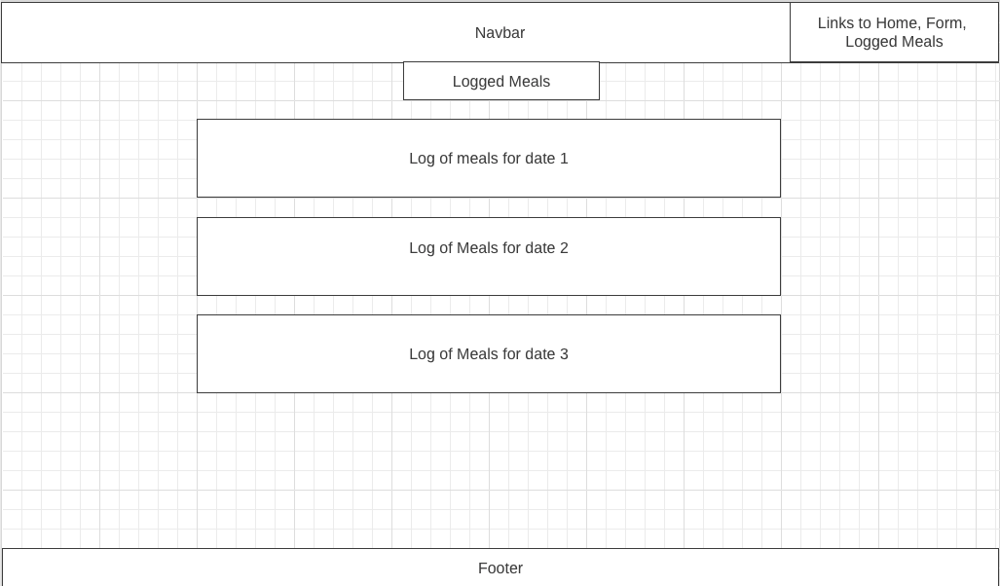
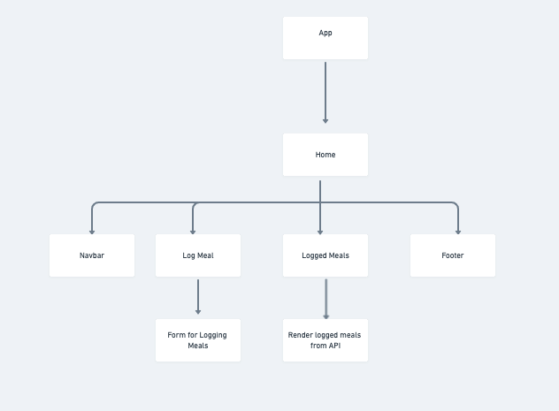

# Calorie Counter


## Project Description

Calorie Counter is a meal tracker that will help you keep track of your meals throughout the day. You will be able to keep a log of your week and be able to log different nutrients such as calories, carbohydrates, protein, etc so you can meet your dietary goals or see what you need to improve on.
## Wireframes

The wireframes below depict how the homepage will be setup, the form input for the meals that the user is logging, and the page that will keep a list of all the meals that the user has saved.





## Component Hierarchy



## API and Data Sample

https://airtable.com/invite/l?inviteId=invxnOzMmODUF0ozU&inviteToken=779afaa6ecda5dc07794a4334f18ed38b869c06a1878a73a62c2350381d6adcc&utm_source=email

Airtable is returning the data for this base as follows:

```
{
    "records": [
        {
            "id": "recrUTJlAhhPhovLI",
            "fields": {
                "calories": 284,
                "protein": 53,
                "fat": 6.2,
                "carbohydrates": 0,
                "food": "chicken breast",
                "date": "7/13/2021"
            },
            "createdTime": "2021-07-13T14:43:11.000Z"
        }

```

### MVP/PostMVP

#### MVP

- Home page with resources to find nutritional values and a navbar that will guide user to log their meals and find their history of logged meals
- Get and post meals from Airtable.
- Use form input to log meal information and update Airtable.


#### PostMVP

- Fill out API with list of common food items that will populate nutrient information for the user so user does not have to search for food items.
- Let user be able to set a goal for their nutrient intake and if they are reaching/notreaching their goal for the day, they receive a message.
- Create a calendar that will let users be able to click through their logged meals

## Project Schedule

| Day      | Deliverable                                | Status   |
| -------- | ------------------------------------------ | -------- |
| Jul 13   | Proposal Approval / Airtable Setup         | Complete |
| Jul 14   | Component Creation / Get, Set Data         | Complete|
| Jul 15   | Continue with React, Begin with CSS styling| Complete |
| Jul 16   | Reach MVP                                  | Complete |
| Jul 17-18| Advanced CSS, begin Post-MVP               | Complete |
| Jul 19   | Presentations                              | Incomplete |

## Timeframes

| Component                 | Priority | Estimated Time | Time Invested |
| ------------------------- | :------: | :------------: | :-----------: | 
| Proposal                  |    H     |      2hrs      |    3 hrs    |
| Airtable setup            |    H     |     1hrs      |   1 hr     | 
| Component setup           |    H     |     2hrs      |    3 hrs     |
| Component creation pg 1   |    H     |      3hrs      |  3 hrs    |
| Component creation pg 2   |    H     |      3hrs      |  3 hrs    |
| Component creation pg 3   |    H     |      3hrs      | 4 hrs    |
| Form creation             |    H     |      3hrs      |  5 hrs    |
| Navbar creation           |    H     |      3hrs      |   2 hrs   |
| Footer creation           |    H     |      3hrs      |   2 hrs  |
| CSS styling logged meals page |    H     |      3hrs      | 3 hrs  |
| CSS styling form          |    H     |      3hrs      |   3 hrs   |
| CSS styling homepage      |    H     |      3hrs      |   2 hrs  |
| CSS styling navbar        |    H     |      2hrs      |   2 hrs  |
| CSS styling footer        |    H     |      2hrs      |   2 hrs  | 
| Total                     |    H     |    36 hrs    |      38 hrs   |

## SWOT Analysis

### Strengths:

I have a clear understanding of the layout and design of the website that I want to create.

### Weaknesses:

I'm still a little shaky on understanding React fully, but will review the lectures and ask for help if needed when I get stuck.

### Opportunities:

React seems to be an in demand skill for many jobs that I have seen. I want to create a smooth aesthetically clean website that I can showcase for future employers.

### Threats:

I tend to get caught up in trying to fix errors and this can cause me to allocate too much time in trying to fix my error by myself. I need to make sure I am not getting too caught up in errors and if I get stuck, either save it for later or reach out to peers or the teachers for help in debugging.
